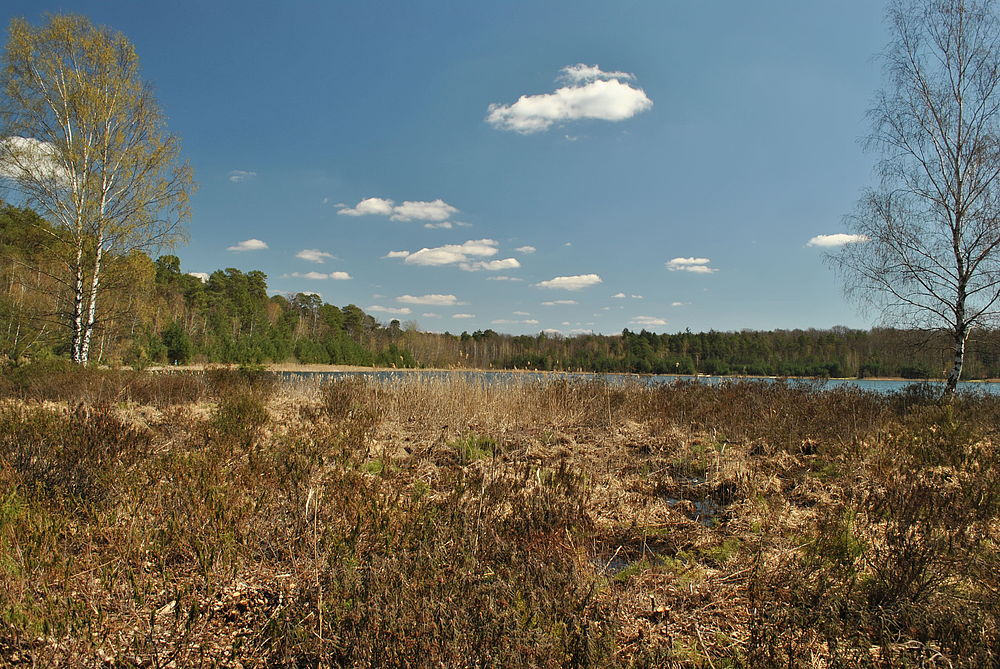

# GeoViewer


ERT survey results from two small lakes in the Cottbus-Brandenburg area of northeastern Germany: **Weißes Lauch** and **Kleinsee**.

## Why ERT near peat lakes?

Brandenburg is a glacial landscape. During the last ice age, retreating glaciers left behind layers of sand, gravel and clay, along with many small lakes and wetlands where peat has been accumulating ever since. That peat matters because it stores a lot of carbon, and knowing how thick it is and where it sits is useful.

ERT works well here because the materials have very different resistivities. Peat is wet and organic so it conducts well. Dry sand and gravel are poor conductors. Clay falls somewhere in the middle. That contrast is what shows up in the inversion images.

The two sites were surveyed with multiple parallel profiles, and the results are what this viewer lets you explore.

## Two ways to look at the data

**In the browser (no setup needed)**

> 🔗 **[geoviewer-ghwnbvhsbfwvkvxflu2msr.streamlit.app](https://geoviewer-ghwnbvhsbfwvkvxflu2msr.streamlit.app)**

Pick a zone, click a profile line on the map, and the inversion image opens on the right.

**As a 3D block on your machine**

All profiles stacked and interpolated into a 3D resistivity volume. You need Python and a local copy of the repo for this one.



## Setup for the 3D viewer

```bash
git clone https://github.com/bordonpablo/geoviewer.git
cd geoviewer

python -m venv .venv
.\.venv\Scripts\activate
pip install -r requirements_dev.txt
```

## Running

Web app locally:
```bash
pip install -r requirements.txt
streamlit run app.py
```

3D viewer:
```bash
python view3d_ert.py weisseslauch
python view3d_ert.py kleinsee
```

Controls in the 3D window:

| Key / action | Effect |
|---|---|
| `T` | Switch between cut planes and fence diagram |
| Right-click | Show nearest profile name |
| Left-click drag | Rotate |
| Scroll | Zoom |
| `R` | Reset camera |
| `P` | Save screenshot |

## Color scale

Log scale from 15 to 2000 Ohm/m, matching the Surfer output from the field reports:

dark blue / cyan / green / yellow / brown / orange / red / dark purple

## Adding a new zone

For the web app, create `data/<zone>/inventory.csv` with these columns:

| Column | What it is |
|---|---|
| `name` | Profile name |
| `type` | `ERT` |
| `zone` | Zone name |
| `lat`, `lon` | Center point (WGS84) |
| `start_lat/lon`, `end_lat/lon` | Line endpoints |
| `image_path` | Path to inversion image |
| `description` | Any notes |

The zone shows up automatically in the app on next restart.

For the 3D viewer, add an entry to the `ZONES` dict at the top of `view3d_ert.py`:

```python
"mynewzone": {
    "title":     "My New Zone",
    "xyz_dir":   r"data\MyNewZone\xyz",
    "y_ref":     1,
    "y_spacing": 15.0,
    "ve":        5,
    "clim":      [15.0, 2000.0],
    "res":       (2.0, 2.0, 1.0),
    "profiles":  {1: "profile1.xyz", 2: "profile2.xyz"},
},
```

## Project structure

```
geoviewer/
├── app.py                 <- web map viewer
├── view3d_ert.py          <- 3D viewer
├── requirements.txt       <- web app only
├── requirements_dev.txt   <- full local setup (includes PyVista)
└── data/
    ├── Weisses Lauch/
    │   ├── inventory.csv
    │   ├── ERT images/
    │   ├── coordinates/
    │   └── xyz/
    └── Kleinsee/
        ├── inventory.csv
        ├── ERT values/
        ├── coordinates/
        └── xyz/
```

## Stack

[Streamlit](https://streamlit.io) · [Folium](https://python-visualization.github.io/folium/) · [PyVista](https://pyvista.org) · [SciPy](https://scipy.org) · [pyproj](https://pyproj4.github.io/pyproj/) · [Pillow](https://pillow.readthedocs.io)
